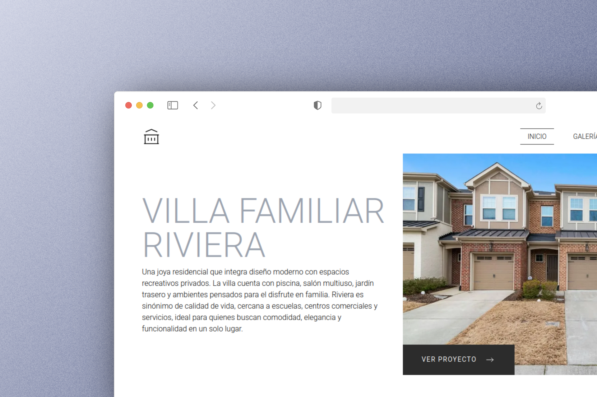

# Residencial Project

Sitio web desarrollado como práctica utilizando React y Tailwind CSS. Este proyecto tiene fines exclusivamente educativos y no está destinado a actividades comerciales.

## Tecnologías utilizadas
- React
- Tailwind CSS
- React Router

## Créditos
El diseño original de esta página pertenece a:

- Autor: [Padre Loo](https://www.figma.com/@yuriylobykin)  
- Diseño original: [Website of architects](https://www.figma.com/community/file/891374608655348853/website-of-architects-free-website)
